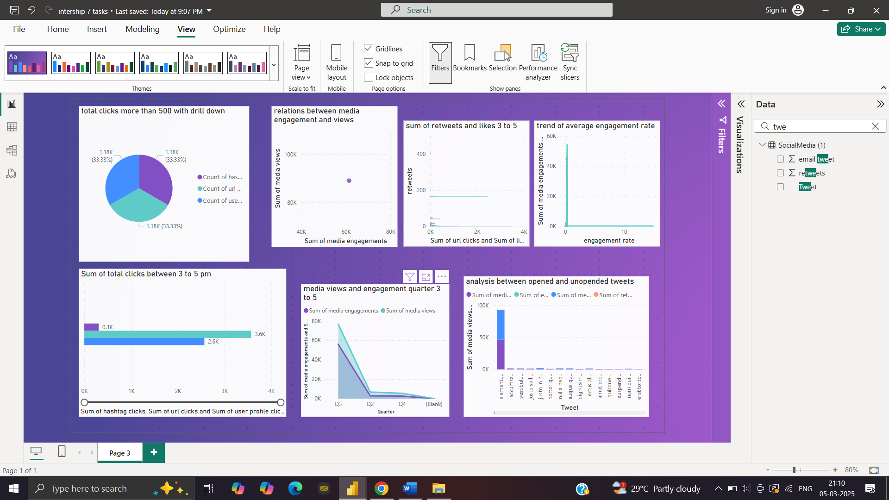

# **Twitter Dashboard Analysis - Power BI**  

## **Overview**  
This project focuses on **Twitter data analysis** using **Power BI**, providing insights into tweet engagement, user interactions, and content performance. The dashboard includes seven key visualizations that help analyze clicks, media engagement, tweet categories, and performance trends.  

## **Complete Twitter Dashboard Overview**  
  

## **Features & Tasks**  

### **1. Pie Chart - Click Proportion Analysis**  
- Displays the **proportion of total clicks** (URL clicks, user profile clicks, and hashtag clicks).  
- Filters tweets with **more than 500 impressions**.  
- **Drill-down feature** to analyze click types per tweet.  

### **2. Clustered Bar Chart - Clicks by Tweet Category**  
- **Breaks down URL clicks, user profile clicks, and hashtag clicks** by **tweet type** (media, links, hashtags).  
- Only includes tweets with **at least one interaction type**.  
- Displayed **only between 3 PM - 5 PM IST**.  
- **Filters:**  
  - **Even-numbered tweet dates**  
  - **Tweet word count > 40**  

### **3. Scatter Chart - Media Engagement vs. Views**  
- Analyzes the **relationship between media engagements and media views**.  
- **Highlights tweets** with an **engagement rate > 5%**.  
- Displayed **only between 6 PM - 11 PM IST**.  
- **Filters:**  
  - Tweets with **more than 10 replies**.  
  - **Odd-numbered tweet dates**.  
  - **Tweet word count > 50**.  

### **4. Top 10 Tweets by Retweets & Likes**  
- Identifies **top 10 tweets** based on the **sum of retweets and likes**.  
- Displays the **user profile that posted each tweet**.  
- Displayed **only between 3 PM - 5 PM IST**.  
- **Filters:**  
  - Excludes **weekend tweets**.  
  - **Even tweet impressions**.  
  - **Odd tweet dates**.  
  - **Tweet word count < 30**.  

### **5. Line Chart - Engagement Rate Trend**  
- Shows the **trend of average engagement rate** over each month.  
- **Comparison:** Tweets with **media content vs. without media**.  
- Displayed **only between 3 PM - 5 PM IST and 7 AM - 11 AM IST**.  
- **Filters:**  
  - **Even engagement rates**.  
  - **Odd tweet dates**.  
  - **Character count < 20**.  
  - **Removes words containing 'C'**.  

### **6. Dual-Axis Chart - Media Views & Engagements**  
- Displays **media views** and **media engagements** by **day of the week**.  
- **Highlights days with significant spikes** in media interactions.  
- Displayed **only between 3 PM - 5 PM IST and 7 AM - 11 AM IST**.  
- **Filters:**  
  - **Even tweet impressions**.  
  - **Odd tweet dates**.  
  - **Character count < 30**.  
  - **Removes words containing 'H'**.  

### **7. Engagement Rate Comparison - App Opens vs. No App Opens**  
- Compares **engagement rates** for tweets **with app opens vs. without app opens**.  
- Includes only tweets **posted between 9 AM - 5 PM on weekdays**.  
- Displayed **only between 12 PM - 6 PM IST and 7 AM - 11 AM IST**.  
- **Filters:**  
  - **Even tweet impressions**.  
  - **Odd tweet dates**.  
  - **Character count < 30**.  
  - **Removes words containing 'D'**.  

